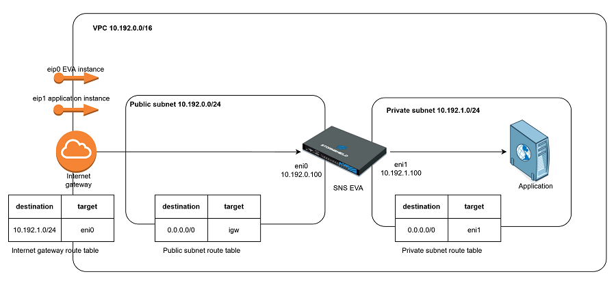
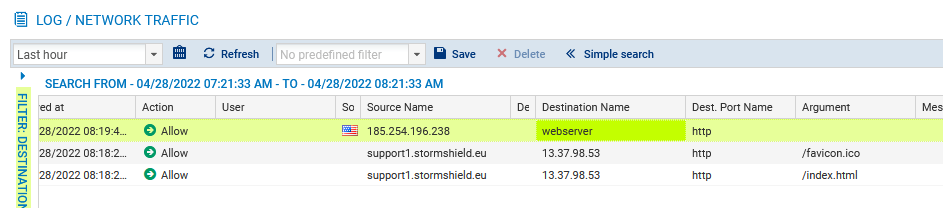

# SNS EVA deployment with ingress routing

AWS now allows to attach a route table to an Internet gateway. It allows to redirect all the ingress traffic to the SNS EVA virtual machine for inspection without configuring the eip as aliases of the EVA network interface.

## Template deployment

* In CloudFormation create a new stack and upload the yaml template (vpc-subnet-filtering-nat.yaml).
* In the Parameters form, choose an existing EC2 key pair and create the stack.
* When the stack is deployed, go to the output tab and get the SNS EVA web-admin url and web application url.

* Access the web application own EIP with a browser.

* From the monitoring tab of the SNS EVA web administration, check that the connection is logged and traffic is inspected.

