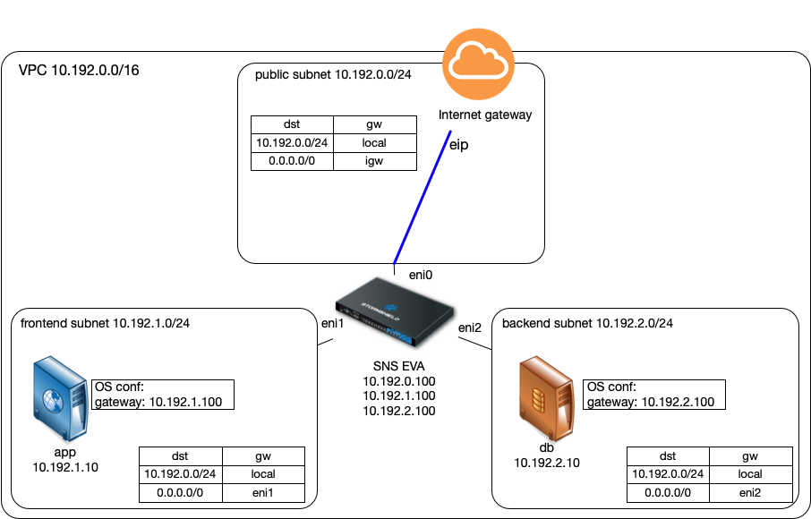
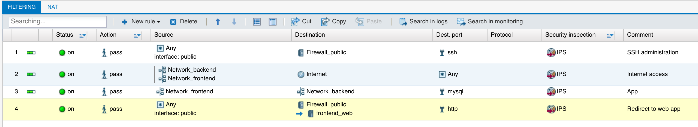
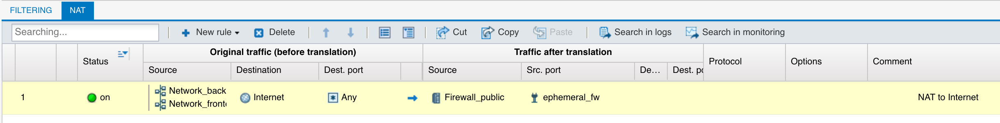
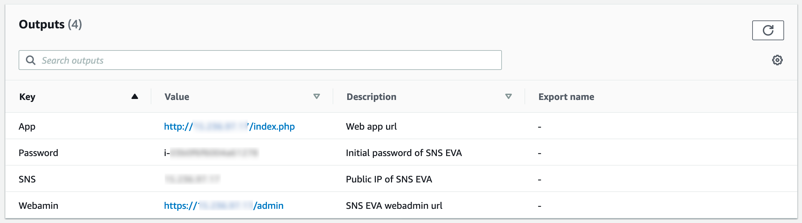
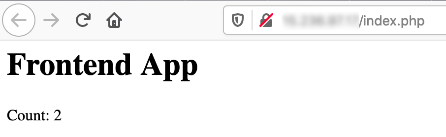
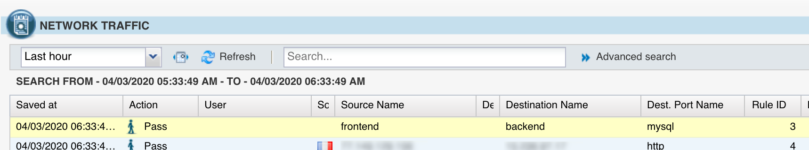

# Inter-subnet traffic inspection in AWS VPC using routing

AWS route tables have a local route for the VPC network at the highest priority and this route can't be overloaded. Thus it is not directly possible to inspect with a SNS EVA the traffic from one subnet to another subnet.

One solution is to change the network configuration of the servers in the subnets and replace the subnet router by the SNS EVA as the default gateway.

The CloudFormation template deploys a web application in the frontend subnet which connects to a database in the backend subnet. The network configurations are edited to use the SNS EVA interfaces in each subnet as default gateway.

The filtering and nat configuration of the SNS EVA:

## Template deployment

- In CloudFormation create a new stack and upload the yaml template (vpc-subnet-filtering-routing.yaml).

- In the Parameters form, choose an existing EC2 key pair and create the stack.

- When the stack is deployed, go to the output tab and get the SNS EVA web-admin url.

- Logon using the instance ID as default password and restore the provided backup file (sns-routing.na). 

- The web and database applications will then be deployed on the Ubuntu servers. A few moment later the web app will be available (see the output tab for the url). Hit the web app page a few times.

- In the web-admin, go to the Audit log / Network traffic screen, you should see the mysql connection between the web server and the database server.

